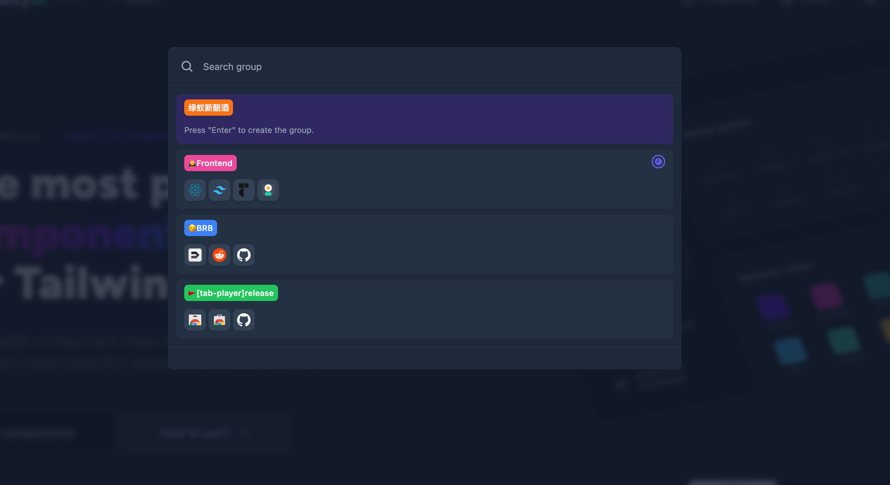
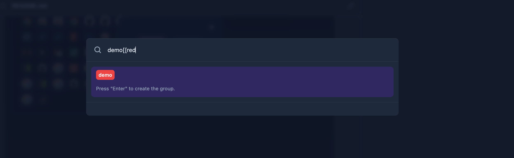
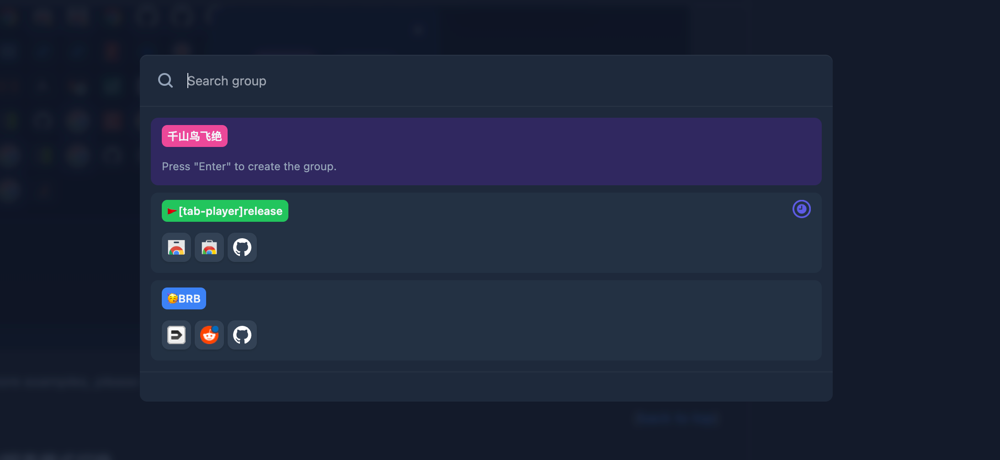
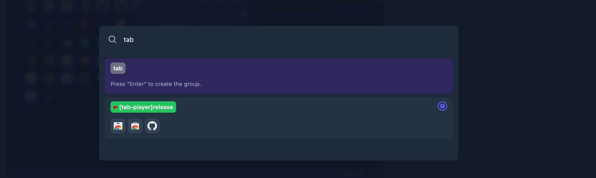
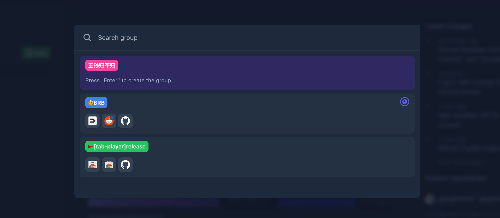

[![Stargazers][stars-shield]][stars-url]
[![Issues][issues-shield]][issues-url]
[![MIT License][license-shield]][license-url]

<!-- PROJECT LOGO -->
 

  

  <h3 align="center">Tab Player</h3>

  

    以一种简便的方式来管理你的 Chrome 标签。
     
     
    <a href="https://chrome.google.com/webstore/detail/tab-player/jnmgfgjcefakjoeoinpncbilkdnikbgc">Install</a>
    ·
    <a href="https://github.com/sipt/tab-player/issues">Report Bug</a>
    ·
    <a href="https://github.com/sipt/tab-player/issues">Request Feature</a>
  

- [项目介绍](#项目介绍)
- [安装](#安装)
- [Tab Clean](#tab-clean)
  - [Tab 筛选](#tab-筛选)
  - [Tab 操作](#tab-操作)
  - [暗黑/明亮模式切换](#暗黑明亮模式切换)
- [Tab Group](#tab-group)
  - [Tab Group 创建](#tab-group-创建)
  - [Tab Group 查看、聚焦、关闭](#tab-group-查看聚焦关闭)
- [Roadmap](#roadmap)
- [赞赏](#赞赏)
- [License](#license)

<!-- ABOUT THE PROJECT -->

## 项目介绍

这个插件有两个部分组成：Tab-Clean 和 Tab-Group。

**Tab-Clean**: 主要面向在使用 Chrome 浏览网页时，会打开很多标签页的场景。这时候使用 Tab Player 可以轻松清理不需要的或目前无用的标签页，使 Chrome 更加清爽。

**Tab-Group**: 更多是培养标签使用习惯，利用 Chrome 自带的 Group 功能，让一件事情聚焦在一个 Group 内。使用 Tab-Palyer 可以方便创建、切换和关闭 Group。

与有相同需求的人分享这个插件。

## 安装

前往 [Chrome Web Store - Tab Player](https://chrome.google.com/webstore/detail/tab-player/jnmgfgjcefakjoeoinpncbilkdnikbgc) 安装插件

## Tab Clean

[![Tab Player Screen Shot][product-screenshot]](https://github.com/sipt/tab-player)

在使用 Chrome 浏览网页时，可能会打开很多标签页，这时候使用 Tab Player 可以轻松清理不需要的或目前无用的标签页，使 Chrome 更加清爽。

虽然已经有很多 Chrome 插件可以管理标签页，但试用了很多都不能完全满足我的需求：

- 可以通过关键词模糊匹配或与标签页当前的状态配合，快速批量选中。
- 可以支持跨窗口选择，但也可以根据窗口来隔离。
- 可以手动选择标签页，或排除一些不想关闭的标签页。
- 可以快捷操作关闭和 Pin，支持全键盘操作。
- 界面更美观。

**！！！ 只在 popup 内使用 ！！！**

(<a href="#readme-top">back to top</a>)

### Tab 筛选

你可以使用关键词（包含在 title 或 URL 中）进行筛选：

- 可以使用保留词进行筛选（`@loading`，`@unloaded`，`@complete`，`@pinned`，`@unpinned`，`@audible`）。当使用保留词时，只能使用一个，并且需要放在输入框开头，用空格与后面的关键词分开。
- 可以使用鼠标左键点击标签页来添加额外的标签页或取消选定的标签页。
- 可以使用鼠标左键点击窗口来锁定筛选生效的窗口。

### Tab 操作

可以在输入框中直接输入 `Enter` 或点击输入框右侧的 Magic 按钮，弹出可操作选项。支持全键盘操作，切换焦点使用 `Tab` 键。目前支持 `Close` 和 `Pin`。

(<a href="#readme-top">back to top</a>)

### 暗黑/明亮模式切换

点击右上角的 月亮 或 太阳 按钮进行切换。

## Tab Group

如果按照 Tab Group 的使用方法，则可以让你的 Chrome 清晰且有条理。

使用理念：把所有的事情聚焦在一个 Group 内。

- 当有一个新的事情，需要查询网页时。新建一个 Tab Group 来处理。
- 当前事情处理过程中，有优先级高的事情插进来，可以创建一个新的 Tab Group 并聚焦在上面。
- 当前事情解决后，可以关闭这个 Tab Group。
- 像需要放松休息时，需要逛逛论坛社交网站，可以放在一个 常驻 的 Tab Group 中，需要时聚焦在这个 Tab Group 上。

以上就是使用的理念，使用 Tab Palyer 可以轻松实现以上动作。

### Tab Group 创建

有两种创建方式：

1. 可以通过 omnibox 使用 `tp` 创建，默认使用 `[[` 切分颜色，如果不设置默认是 grey。（可选颜色："grey","blue","red","yellow","green","pink","purple","cyan","orange"）
   

2. 可以通过 `cmd + shift + o` 呼出 Tab Group 弹窗进行操作。默认使用 `[[` 切分颜色，不设置默认是 `grey`。（可选颜色："grey","blue","red","yellow","green","pink","purple","cyan","orange"；这个弹窗只能在可以运行 content script 的页面呼出）
   
   不输入任何内容，会随机一个名称和颜色，输入 `Enter` 就会创建。
   

### Tab Group 查看、聚焦、关闭

Tab Group 可以通过关键词搜索：

在列表中右侧的小时钟图标表示当前聚焦，选中其它 item，按下 `Enter`，可以切换聚焦。**！！！当聚焦在一个 Tab Group 时，创建同一个 Window 下新的 Tab 会自动归入聚焦的 Group 中。**

在选中一个 Tab 且 焦点在输入框中，按下 `Cmd + Enter` 可以关闭一个 Group。

<!-- ROADMAP -->

## Roadmap

- [x] 1.0 基础功能支持
  - 灵感来源 💡：在使用 Chrome 过程中，个人习惯会打开很多的 Tab。所以想能有个方便的方式批量关闭这些 Tab。
  - [x] 支持关键词筛选
  - [x] 支持保留词筛选
  - [x] 支持 鼠标选择/取消选择 Tab
  - [x] 支持 鼠标选择/取消选择 Window
  - [x] 支持 关闭/Pin Tab
  - [x] 支持关闭 Window
  - [x] 支持暗黑/明亮主题
- [ ] 1.1 Amazing! Group & Switch Tab
  - 灵感来源 💡：有时候在处理一个问题时，会打开很多个 Tab，但他们又归属于一个来源，所以希望它们可以在一个 Group 中。我在处理一个新的问题时，可以再新建一个 Group，原生的交互并不友好。Tab 之间的切换也希望可以像操作系统中的 `Alt(Opt)+Tab` 或 Cmd+` 一样丝滑。
  - [ ] Tab 切换
  - [ ] Group 切换
  - [ ] Group 创建与列表
- [ ] 1.2 SmartBox & Options
  - [ ] 支持智能规则筛选（SmartBox）
    - [ ] Tab Status
    - [ ] Tab 长期不活跃
    - [ ] 预置策略
  - [ ] Options
- [ ] 1.3 待计划。。。

(<a href="#readme-top">back to top</a>)

## 赞赏

觉得这个项目不错，给个 Star 或 请我喝杯咖啡：
|微信赞赏|支付宝赞赏|
|---|---|
|||

<!-- LICENSE -->

## License

Distributed under the MIT License. See `LICENSE.txt` for more information.

(<a href="#readme-top">back to top</a>)

<!-- MARKDOWN LINKS & IMAGES -->
<!-- https://www.markdownguide.org/basic-syntax/#reference-style-links -->

[stars-shield]: https://img.shields.io/github/stars/sipt/tab-player.svg
[stars-url]: https://github.com/sipt/tab-player/stargazers
[issues-shield]: https://img.shields.io/github/issues/sipt/tab-player.svg
[issues-url]: https://github.com/sipt/tab-player/issues
[license-shield]: https://img.shields.io/github/license/sipt/tab-player.svg
[license-url]: https://github.com/sipt/tab-player/blob/master/LICENSE.txt
[product-screenshot]: doc/demo-video.gif
